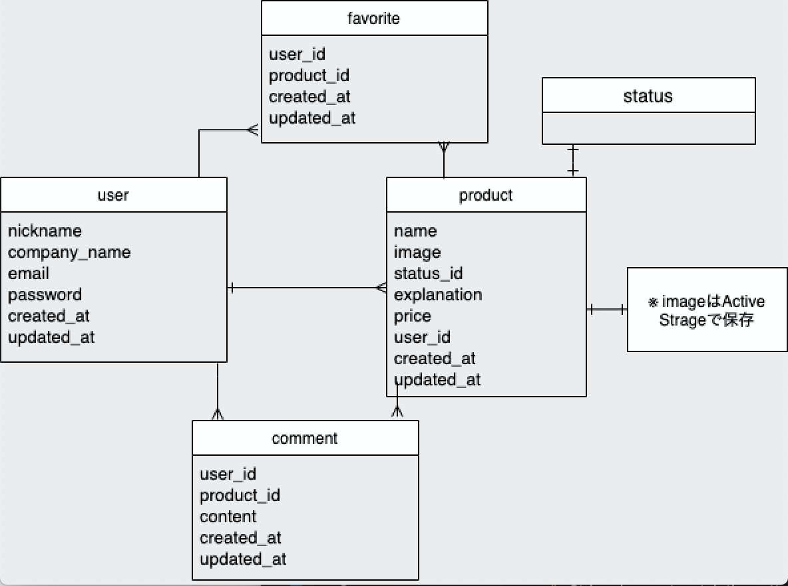

# B-products

## URL

http://b-products.work/

画面右上からゲストユーザーとしてもログインすることができます。

## アプリケーションの概要

メーカー製品の投稿・共有ができるポートフォリオです。

### テーマを選んだ理由

現在私は素材メーカーの技術開発職をしています。生産品の中では、B 品(ユーザーに出荷できないもの)が存在します。個人では使用できるレベルですが、顧客の基準から次工程には出荷できない B 品が大量に廃棄されてしまっていることに非常に勿体ないと感じています。このような「勿体ない」を減らすために、企業(メーカー)の供給と個人の需要をマッチさせるための共有場があればと思い、本アプリを作成しました。

### ターゲットユーザー

メーカー従事者

## 工夫した点

- AWS、Docker、CircleCI の導入
  - モダンな技術に触れてみたいという好奇心から導入しました。
- N+1 問題の解消による処理速度向上
  - トップページの読み込みに時間が相当(3 秒以上)かかっていたものを N+1 問題を解消することで(1 秒未満)に短縮することができました。
- UI/UX の向上
  - レスポンシブ対応や要所では Ajax を使用することで、見やすさを心がけました。

## 機能・技術

- 新規投稿機能
- 一覧表示機能、詳細表示機能
- 編集機能 、削除機能
- 無限スクロール(kaminari, ajax)
- ユーザー管理機能(devise)
- 検索機能(ransack)
- コメント機能(ajax)
- いいね機能(ajax)
- テスト(Rspec, faker)
- ruby 構文チェック(rubocop)

### 今後実装したいこと

- 環境(バージョン)の統一(※現状ローカルでの動作でエラーが出てしまいます)
- CircleCI/CD の本番環境運用
- 個人チャット機能
- コメントやいいねの通知機能

## 環境

- フロントエンド
  - HTML
  - CSS
  - Javascript、jQuery
- バックエンド
  - Ruby 2.6.5
  - Rails 6.0.0
- データベース
  - MySQL/MariaDB
- ソースコード管理
  - GitHub
- 開発環境
  - Docker/Docker-compose
  - CircleCI
- 本番環境
  - AWS(S3、Route5S、EC2)
  - Nginx、Unicorn
  - Capistrano

## DB 設計

